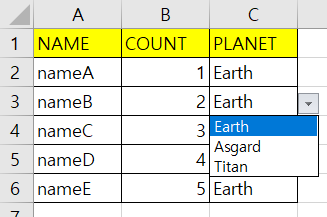
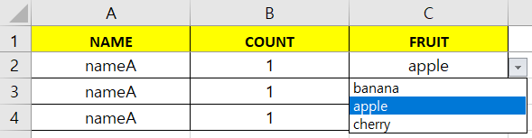
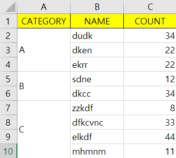
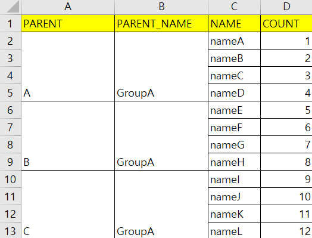
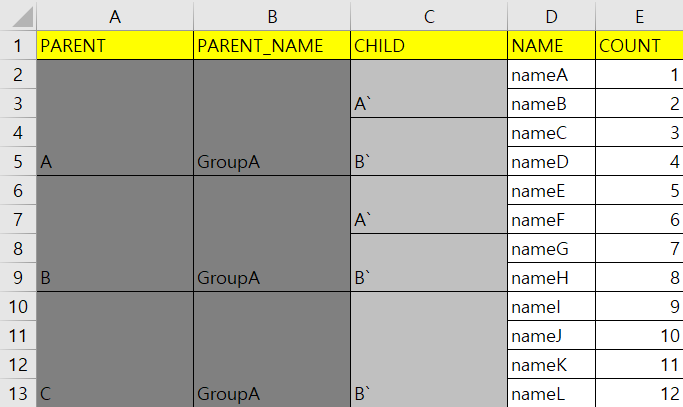

# Excel Object Mapper

`EOM(Excel Object Mapper)`는 Excel 데이터를 미리 정의한 `@ExcelObject` & `@ExcelColumn` 값에 따라 매핑하는 라이브러리입니다.


## @ExcelObject

다음 에너테이션은 `Class`에 설정가능합니다. 시트이름과 시트의 색상을 설정할 수 있습니다.

필수적이지 않으며 설정하지 않을 경우 기본값으로 설정됩니다.

- `name` : 시트의 이름을 설정합니다. (default : "default")
- `uniqueKeys` : 유니크항목을 지정하는 메타데이터
- `cellColor` : Cell 색상 (default : IndexedColors.YELLOW)
- `borderStyle` : 테두리 스타일 (default : BorderStyle.THIN)
- `borderColor` : 테두리 색상 (default : IndexedColors.BLACK)

```java
@Excelobject(name="default", uniqueKeys={"name"})
public class Inventory {
    
    @ExcelColumnt(name="NAME", index=0)
    public String name;
    
    @ExcelColumn(name="COUNT", index=1)
    public Integer count;
    
}
```


## @ExcelColumn 

시트의 Column을 정의하는 어노테이션입니다. 

- `name` : Column 노출 이름
- `index` : Column 순서
- `group` : Column 그룹
  - 그룹이란, Column의 동일한 항목을 묶어 노출하는 기능을 말합니다.
- `dropdown` : 동적 Dropdown Key
- `nullable` : 빈값 가능 여부 (default : true)
- `width` : 넓이 (default : 15)
- `alignment` : 정렬 (default : CellStyle.ALIGN_CENTER)
- `cellColor` : Cell 색상 (default : IndexedColors.WHITE)
- `borderStyle` : 테두리 스타일 (default : BorderStyle.THIN)
- `borderColor` : 테두리 색상 (default : IndexedColors.BLACK)

> 기본예제

```java
public class Inventory {
 
    @ExcelColumn(name="NAME", index=0)
    public String name;
    
    @ExcelColumn(name="COUNT", index=1)
    public Integer count;
    
}
```


### Dropdown 

> 드랍다운예제 A (Enum) 

- 자료형에 `Enum`을 사용할 경우 엑셀에서 `Dropdown`으로 구성됩니다. 

```java
public enum Planet {
    Earth,
    Asgard,
    Titan
}

public class Inventory {

    @ExcelColumnt(name="NAME", index=0)
    public String name;
    
    @ExcelColumn(name="COUNT", index=1)
    public Integer count;

    @ExcelColumn(name = "PLANET", index = 2)
    public Planet planet;

}
```




> 드랍다운예제 B (Dymamic)

- 드랍다운을 동적으로 구성할 때, `Dropdown` 클래스를 사용하여 데구성할 수 있습니다.
- Dropdown 인스턴스를 생성한 후, `initDropdowns()` 메소드에 Dynamic Dropdown 인스턴스를 넣어줍니다.
- @ExcelColumn내에 `dropdown` 속성값에 동적 Dynamic Dropdown의 key 값을 선언합니다.
- 주의할 점으로 dropdown 항목인 `fruitKey`는 `노출 값이 아닌 key 값`으로 설정된 다는 것입니다.

```java
Map optionMap = new HashMap<>();
optionMap.put("apple", "a");
optionMap.put("banana", "b");
optionMap.put("cherry", "c");
Dropdown dropdownA = new Dropdown("dropdown_key", optionMap);

ExcelObjectMapper.init()
    .initDropdowns(dropdownA, ..)

public static class Inventory {

    @ExcelColumn(name = "NAME", index=0)
    public String name;

    @ExcelColumn(name = "COUNT", index=1)
    public Integer count;

    @ExcelColumn(name = "FRUIT", index=2, dropdown="dropdown_key")
    public String fruitKey;

}
```




### Group

> 그룹예제 A

- `group`의 기본값을 0이며, 숫자가 커질 수록 상위 그룹을 의미합니다.
- `group`으로 데이터가 묶여 노출되기 때문에 같은 이름이 있어선 안됩니다.

```java
public class Inventory {
    
    @ExcelColumnt(name="CATEGORY", index=0, group=1)
    public String category;
    
    @ExcelColumnt(name="NAME", index=1)
    public String name;
    
    @ExcelColumn(name="COUNT", index=2)
    public Integer count;
    
}
```



> 그룹예제 B

- 같은 Group이 2개 이상일 경우
  - `index`가 높은 필드에 따라 그룹 범위가 정해지며, `index`가 낮은 필드는 이미 정해진 그룹 범위를 따라 갑니다.

```java
public class Inventory {

    @ExcelColumn(name = "PARENT", group = 2, index = 0)
    public String parentGroup;

    @ExcelColumn(name = "PARENT_NAME", group = 2, index = 1)
    public String parentGroupName;

    @ExcelColumn(name = "NAME", index = 3)
    public String name;

    @ExcelColumn(name = "COUNT", index = 4)
    public Integer count;

}
```



사진을 보면 `PARENT_NAME`열은 열간에 "GroupA"라는 같은 항목을 가지지만 `PARENT` 열의 영향을 받아서 범위가 정해집니다.


> 그룹예제 C

- 다른 Group이 3개 이상일 경우

```java
public class Inventory {

    @ExcelColumn(name = "PARENT", group = 2, index = 0, cellColor = IndexedColors.GREY_50_PERCENT)
    public String parentGroup;

    @ExcelColumn(name = "PARENT_NAME", group = 2, index = 1, cellColor = IndexedColors.GREY_50_PERCENT)
    public String parentGroupName;

    @ExcelColumn(name = "CHILD", group = 1, index = 2, cellColor = IndexedColors.GREY_25_PERCENT)
    public String childGroup;

    @ExcelColumn(name = "NAME", index = 3)
    public String name;

    @ExcelColumn(name = "COUNT", index = 4)
    public Integer count;

}
```



사진을 보면 `CHILD`열은 4행과 5행이 "B`"라는 값으로 연결되지만 앞선 그룹에 의해서 분리됩니다.


## ExcelObjectMapper

ExcelObjectMapper는 빌드를 실행하는 클래스입니다. 

Excel -> Object로 변환하는 `buildSheet`와 Object -> Excel로 변환하는 `buildObject` 두 가지의 메소드를 제공합니다.

내부적으로 `ColumnElement.class`라는 Iterator가 있기 때문에 반드시 정의된 object를 사용해야 하는 것이 아닌 

`List<ColumnElement>`로도 빌드가 가능합니다. (TODO : 제공예정)


> buildSheet (Excel -> Object)

```java
List<Inventory> items = ExcelObjectMapper.init()
    .initModel(Inventory.class)
    .initSheet(sheet)
    .buildSheet()
```


> buildObject (Object -> Excel)
>
> - initBook이 추가적으로 필요합니다. ( CellStyle 작업을 위함 )

```java
ExcelObjectMapper.init()
    .initModel(Inventory.class)
    .initBook(book)
    .initSheet(sheet)
    .buildObject(items)
```


## Exception

### LazyReturn

EOM 기능에는 크게 Header와 Body 2가지 예외처리가 있습니다. 

Header에서 발생하는 예외처리는 Object Column 항목과 Excel의 첫 번째 행이 동일하지 않을 때 발생하며 즉각적으로 예외를 반환합니다.

Body에서 발생하는 예외는 데이터 항목이 올바르지 않을 때 발생하며, 모든 Body 데이터의 확인이 끝난 후에 예외가 있으면 예외를 반환합니다.

또한 내부적으로 `detail(List<EOMCellException>)`항목을 가지고 있기 때문에 Body 데이터 내에 예외 사항을 상세히 확인할 수 있습니다.


- `EOMException`(code, message, args)
  - `EOMDevelopmentException` - 개발자 Exception
  - `EOMHeaderException` - Header Exception
  - `EOMBodyException` - Body Exception
    - `EOMCellException`(row, column)

| Exception                       | Code | Desc                                                         |
| ------------------------------- | ---- | ------------------------------------------------------------ |
| EOMHeaderException              | 100  | Header에서 발생하는 예외입니다.                              |
| EOMNotFoundDropdownKeyException | 101  | 초기화된 동적 Dropdown이 없을 때 발생하는 에러입니다.        |
| EOMBodyException                | 200  | Body에서 발생하는 예외처리로 <br />모든 Body를 확인한 후에 예외를 반환합니다.  (Lazy-Throw) |
| EOMCellExceltion                | 201  | EOMBodyException내에 세부항목을 나타내는 예외입니다.<br />세부항목 예외는 EOMCellException을 상속받으며,<br />Uncaught 예외는 EOMCellException을 직접 사용합니다. |
| EOMNotNullException             | 202  |                                                              |
| EOMWrongDataTypeException       | 203  |                                                              |
| EOMNotContainException          | 204  |                                                              |
| EOM                             | 205  |                                                              |

